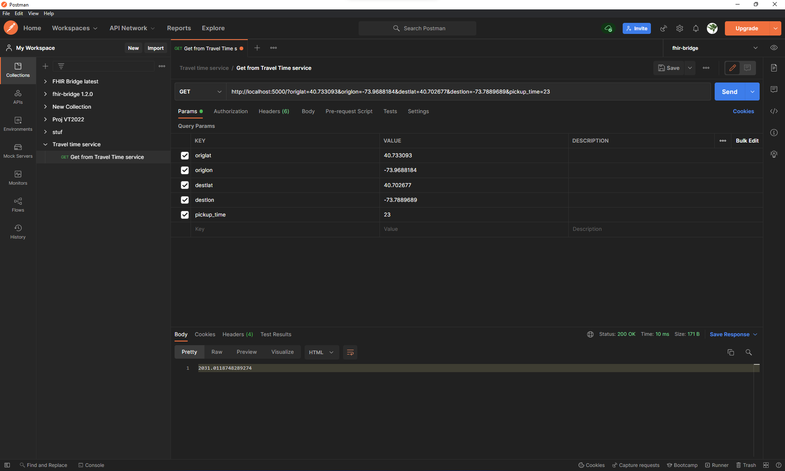
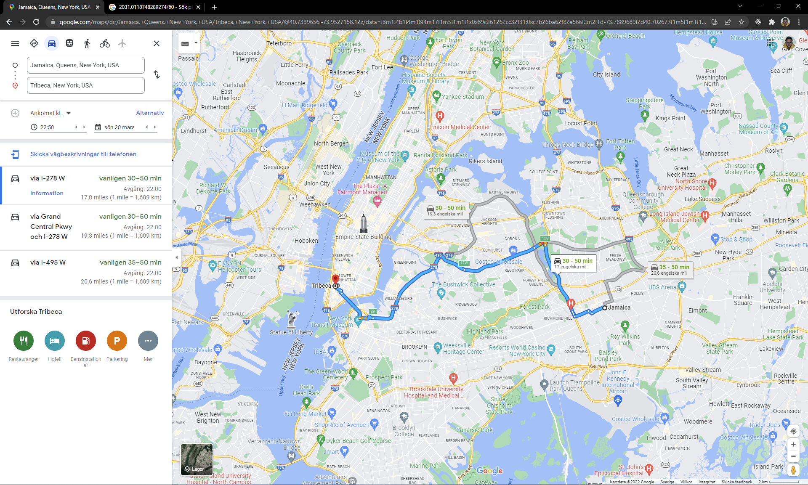
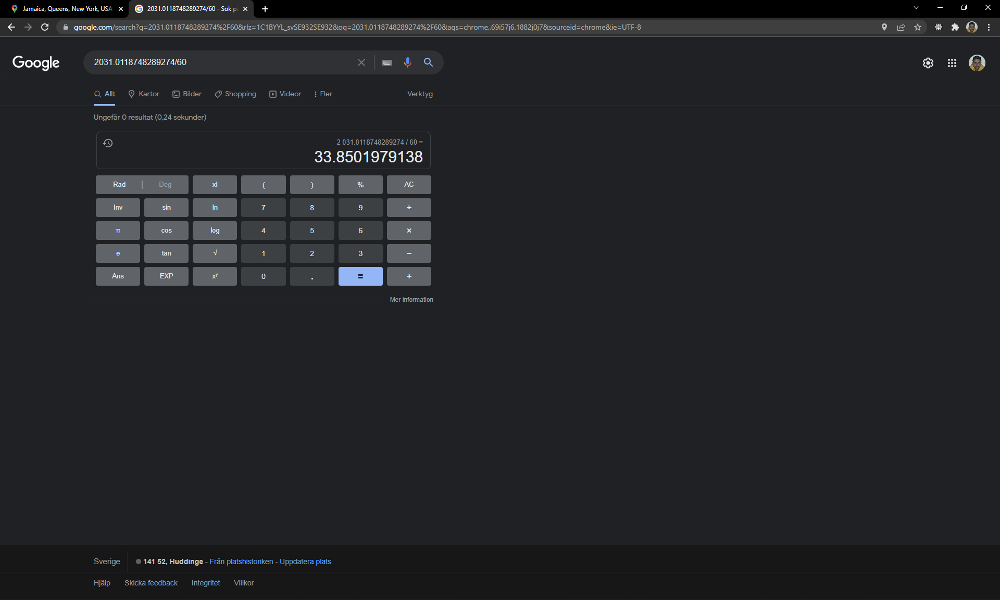

# NYC Taxi travel time service
**CM1001 Applied machine learning**

Pierre Le Fevre, Kalle Janrik

## Files
To run this project from scratch, run the files in the following order:
```
    import_and_clean.ipynb
    analytics.ipynb
    train_model.ipynb
    api.py
```

## Import and clean
This notebook shows the process taken to data clean and append all 2019 taxi files to one large csv file. 

Overview:
- Absolute timestamps are converted to a travel time in minutes.
- Pickup time is converted to hours since midnight.
- Any outlier over 5 hours is removed.
- Rows with invalid location IDs are removed.
- Location IDs are converted to coordinates.
- A distance is calculated by comparing coordinates.


## Analytics

This notebook will show some key metrics and information about the dataset. Understanding the dataset allows us to create a better data cleaning and choose a more fitting model.

## Train model

This notebook trains a sklearn model.

Overview:
- CSV file is read in chunks.
- Model input (X) is scaled.
- Scaled input is fitted to a polynomial function.
- Data with polynomial features is split to train and test.
- Linear regression model is then fit to input.
- Prediction is evaluated and next batch is loaded.

## API
Flask API that reads a saved Joblib file for model, scale and poly features.

Example input for the API: 
`40.778239, -73.956004, 40.742329, -73.980064, 0, 0.04322512810854774`

API is run through `python api.py` and will run at `http://localhost:5000/`

To run the example values, try visiting: http://localhost:5000/?origlat=40.778239&origlon=-73.956004&destlat=40.742329&destlon=-73.980064&pickup_time=8&distance=0.04322512810854774

A postman collection is included.

## Conclusion

The accuracy seems to be between 25-35%. This is likely due to data being very spread out over a large geographic area, and that the centroids for each zone are not randomized. 

For yellow cab trips, the model is quite accurate and generally guesses within error margin of google maps. For example, Google quotes 30 minutes for a trip between Tribeca and Jamaica, and our model quotes 35 minutes for the same trip.

Analyzing the data, it is clear that a classifier would have done a good job aswell, and we would also have liked to try a neural network on this.
Due to limitations, we stuck to a simple Regressor, which outputted acceptable but not perfect data.

At 10 ms, the API responds well within the service agreement window of 1 second.


## Example run

> Postman run with example coordinates


> Maps estimate


> Conversion to seconds
